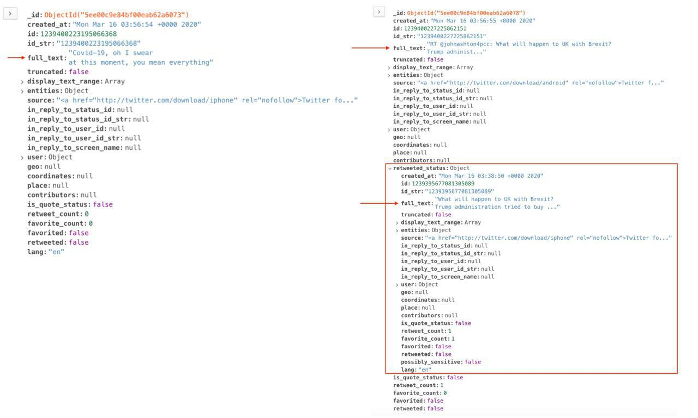
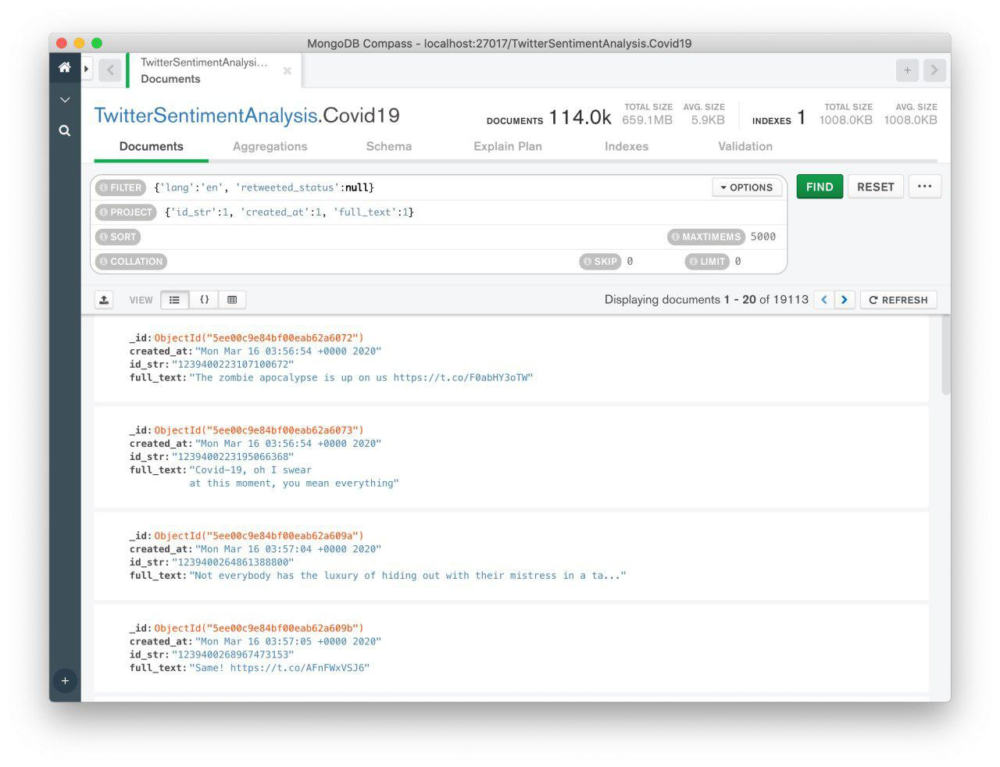
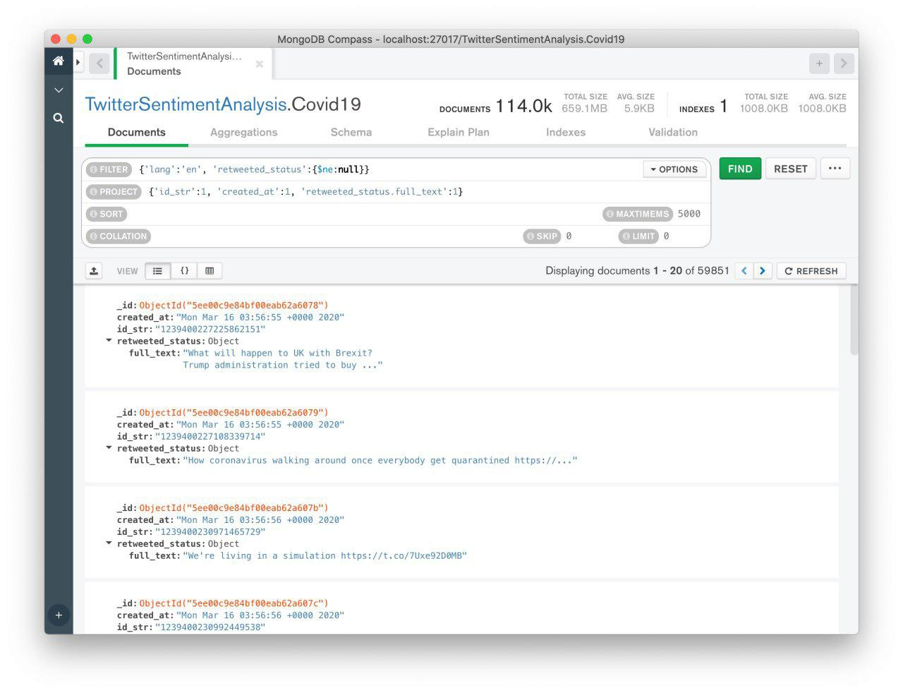

# Covid19 Twitter SentimentAnalysis
The aim is to define a sentiment analysis algorithm using twitter dataset to detect the reactions of italian (european) people during recent lockdown.

<body>
  

    

<h1>Tesina di Big Data and Business Intelligence - Sentiment Analysis</h1>

<h3>Autori: Emanuele Di Fiore, Roberto Di Luca</h3>
 
 Nella presente tesina è stata svolta una Sentiment Analysis su un dataset di Tweet estratti dal social network Twitter per valutare le reazioni degli utenti durante il recente lockdown causato dalla diffusione del virus Covid-19. Le tecnologie utilizzate sono state:

<ul>
<li>Apache Spark 2.4.5 (tramite la libreria pyspark) come ambiente per il preprocessing dei tweet, per la loro etichettatura, per l'addestramento e la valutazione di un modello di Machine Learning (ML);</li>
<li>MongoDB come database NoSQL per lo storage dei tweet;</li>
<li>Python per l'estrazione dei tweet tramite il tool Twarc.</li>
</ul>

Il lavoro è strutturato come segue:

<ul>
<li><a href="#1">Cenni alla teoria della Sentiment Analysis, estrazione dei tweet e introduzione al loro formato</a></li>
<li><a href="#2">Etichettatura del dataset usando la libreria nltk (modello Vader)</a>;</li>
<li><a href="#3">Addestramento di un modello di ML sul dataset etichettato e calcolo dell'accuracy</a>;</li>
<li><a href="#4">SentiWordNet per l'etichettatura del dataset</a>;</li>
<li><a href="#5">Analisi delle performance di Spark</a>.</li>
</ul>

Inoltre è presente un'<a href="#7">appendice</a> riguardante l'installazione in locale di Spark e MongoDB.
 Infine, una sezione per i <a href="#8">riferimenti</a> utilizzati nella trattazione.

Tutto il codice sviluppato è presente su Github al seguente <a href="https://github.com/emdifiore22/Covid19-Twitter-SentimentAnalysis">link</a>.

<a id='1'>
    <h3>Sentiment Analysis e formato dei tweet</h3>
</a>

 Ogni giorno, grazie ai social network, ai blog o ad altri sistemi di raccomandazione, vengono scambiati milioni di messaggi su Internet. Tali messaggi possono essere suddivisi in due principali categorie: fatti e opinioni. I fatti sono affermazioni oggettive, mentre le opinioni riflettono un sentimento di un utente rispetto a un utente, altre persone o eventi e sono molto importanti quanche c'è la necessità di prendere delle decisioni. L'espressione <b>Sentiment Analysis</b> (anche nota come Opinion Mining) fa riferimento all'uso di tecniche di Natural Language Processing (NLP), Text Analysis e Linguistica Computazionale per identificare ed estrarre informazioni soggettive in documenti, commenti e post [1].
 Un esempio di applicazione si ha nelle aziende che forniscono prodotti o servizi e che quindi sono interessate a conoscere i commenti o le opinioni dei loro clienti per garantire loro una qualità sempre più elevata.
 Durante il recente periodo di lockdown che abbiamo vissuto a causa del virus Covid-19, molte persone hanno usato i social network, Twitter in particolare, per esprimere i loro stati d'animo. In questa tesina, è stata usata una parte del dataset GeoCoV19 [2]. I tweet scaricati sono stati memorizzati su MongoDB e preprocessati e analizzati tramite Spark al fine di conoscere quali sono stati i sentimenti predominanti.

<h5>Perché MongoDB?</h5>

 Le tecnologie NoSQL sono particolarmente note per la loro caratteristica di essere "schema-less", ovvero i dati in essi memorizzati non devono necessariamente sottostare a uno schema prefissato così come nelle soluzioni relazionali. Tale caratteristica si presta molto bene al caso in esame, in cui i singoli tweet (la cui struttura è spiegata nel seguito) non rispettano rigorosamente una struttura. Ad esempio, se un tweet è originale (ovvero non ne ricondivide un altro) non presenta alcuni campi, tra cui il campo "retweeted_status".
  In particolare, tra le varie soluzioni non relazionali, è stato scelto <b>MongoDB</b> per il suo orientamento ai documenti. Infatti, memorizza i dati in un formato JSON-like (BSON, Binary JSON), che è un "cugino" del formato JSON restituito dal tool utilizzato per estrarre i tweet. Questo ha reso molto rapida l'importazione dei dati nel DB.
  Nella scelta di un DB NoSQL pesa anche il tipo di operazioni che si intende effettuare sui dati. Nel nostro caso, non è stato necessario analizzare eventuali relazioni tra i tweet, ma solo dei filtraggi sulla base dei valori per alcuni campi. Ciò ci ha portato a dire che una soluzione diversa da quella documentale, ad esempio una orientata ai grafi (Neo4j), non è la più indicata.

<h5>Estrazione dei Tweet</h5>
 Sebbene i termini d'uso delle API di Twitter sconsiglino la condivisione via web dei dati raccolti, consentono quella di file contenenti gli id dei tweet. A questo punto, con un processo noto come "Hydration" è possibile ricavare l'intera struttura dati del tweet tramite il suo id.
 Il processo di Hydration è molto semplice: data una collezione di identificativi (id) è possibile utilizzare <b>Twarc</b>, un tool, disponibile anche come libreria Python, che permette di scaricare tweet rappresentati in formato JSON. Per poter effettuare il download dei tweet è necessario creare un’app con un account developer di Twitter, ottenere le chiavi Consumer API e i token di accesso e utilizzare tali informazioni per abilitare Twarc al download. In particolare, tale abilitazione può avvenire in due modi:
&lt;/div&gt;

<ul>
<li>Utilizzando il tool a linea di comando: lanciare twarc configure e seguire tutte le indicazioni per la registrazione delle chiavi e dei token</li>
<li>In Python, utilizzare il costruttore:</li>
</ul>

In&nbsp;[&nbsp;]:

    

<pre>t = Twarc(consumer_key, consumer_secret, access_token, access_token_secret)
</pre>

    

 Per poter estrarre i tweet è stato utilizzato lo script TwarcTwitterExtraction.py, disponibile nel repository GitHub del progetto. Tale script utilizza in input una lista di identificativi e genera in output un file in formato JSON Lines contenente i JSON dei tweet. Per tale elaborato sono stati gli identificativi associati alle date:

<ul>
<li>13/02/2020</li>
<li>16/03/2020</li>
<li>29/03/2020</li>
<li>30/03/2020</li>
<li>08/04/2020</li>
<li>29/04/2020</li>
</ul>

A causa dell’elevata quantità di id presenti in questi file, essi sono stati processati soltanto in parte, arrivando a raccogliere 113965 tweet.

<h5>Struttura di un tweet</h5>
 In generale, un utente può postare un tweet in due modi:

<ul>
<li>Scrivendo un contenuto originale;</li>
<li>Condividendo un tweet di un altro utente.</li>
</ul>

Dalla struttura JSON di un tweet è quindi possibile capirne la tipologia, il testo associato, informazioni sull’utente che l’ha postato, la data, le informazioni di geolocalizzazione, etc. Per lo svolgimento dell’elaborato sono stati fondamentali i seguenti campi o strutture:

<ul>
<li><b>full_text</b>: contenente il testo completo del tweet;</li>
<li><b>lang</b>: contenente la lingua con cui è stato scritto quel tweet;</li>
<li><b>retweeted_status</b>: in caso di retweet, rappresenta una struttura innestata contenente tutte le informazioni del tweet che è stato ricondiviso (autore, testo del post, etc.), altrimenti il campo non è presente.</li>
</ul>

Di seguito è mostrata la struttura completa di un tweet con e senza retweeted_status.

<h5>Filtraggio</h5>
 Una volta memorizzati tutti i tweet in una collection MongoDB, si è deciso di utilizzare per la Sentiment Analysis tutti i tweet in lingua inglese (campo lang uguale a ‘en’) e di selezionare il campo full_text per i tweet originali ed il campo retweeted_status.full_text per i tweet frutto di ricondivisione. Tale filtraggio si può facilmente effettuare tramite delle query ad hoc sul database. Le possibilità sono due:

<ul>
<li>Utilizzare il tool <b>MongoDB Compass</b> per effettuare le query utilizzando l’interfaccia grafica e poi esportare i risultati in formato JSON (da caricare successivamente in ambiente Spark);</li>
<li>Utilizzare direttamente <b>MongoDB Spark Connector</b>.</li>
</ul>

Nel primo caso abbiamo:

Nel secondo caso abbiamo il codice seguente:

In&nbsp;[&nbsp;]:

    

<pre>pipeline_noRetweet = &quot;[\
    {\
        &#39;$match&#39;: {\
            &#39;lang&#39;: &#39;en&#39;,\
            &#39;retweeted_status&#39;:null\
        }\
    },{\
        &#39;$project&#39;: {\
            &#39;id_str&#39;: 1\
            &#39;created_at&#39;: 1\
            &#39;full_text&#39;: 1\
        },\
    }\
]&quot;

pipeline_Retweet = &quot;[\
    {\
        &#39;$match&#39;: {\
            &#39;lang&#39;: &#39;en&#39;\
            &#39;retweeted_status&#39;:{$ne: null}\
            &#39;retweeted_status.full_text&#39;:&#39;en&#39;\
        }\
    },{\
        &#39;$project&#39;: {\
            &#39;id_str&#39;: 1\
            &#39;created_at&#39;: 1\
            &#39;retweeted_status.full_text&#39;: 1\
        },\
    }\
]&quot;

df_ENGNoRetweet = spark.read.format(&quot;com.mongodb.spark.sql.DefaultSource&quot;).option(&quot;pipeline&quot;, pipeline_noRetweet).load()
df_ENGRetweet = spark.read.format(&quot;com.mongodb.spark.sql.DefaultSource&quot;).option(&quot;pipeline&quot;, pipeline_Retweet).load()

df_ENGNoRetweet.printSchema()
df_ENGRetweet.printSchema()
</pre>

    

In entrambi i casi l’idea è stata quella di selezionare, in una prima query, tutti i tweet che non presentano il campo retweeted_status e ricavare da essi il campo full_text, mentre in una seconda query il campo full_text è ricavato solo da quei tweet che presentano il campo retweeted_status. 
 In particolare, nel secondo caso (tweet frutto di ricondivisione) il campo full_text è identico al campo retweeted_status.full_text a meno dell’aggiunta di alcuni caratteri. Facciamo un esempio per chiarire la situazione. Supponiamo che Bob abbia ricondiviso il tweet “Spark è potentissimo!” di Alice, il tweet di Bob presenta nella propria struttura JSON:

<ul>
<li><b>full_text</b>: “RT @alice: Spark è potentissimo!”</li>
<li><b>retweeted_status.full_text</b>: “Spark è potentissimo!”</li>
</ul>

Come si vede, il contenuto utile del tweet è lo stesso, si è deciso di considerare solo il secondo.
Poiché, in generale, può capitare che più utenti ricondividano lo stesso tweet, potrebbero esserci dei testi duplicati. Per rimuoverli è stato utilizzata una distinct() sul DataFrame contenente i tweet.

In&nbsp;[&nbsp;]:

    

<pre>df_Tweets = df_ENGRetweet\
    .selectExpr(&quot;id_str&quot;, &quot;retweeted_status.full_text as full_text&quot;)\
    .union(df_ENGNoRetweet.select(&quot;id_str&quot;, &quot;full_text&quot;))

df_Tweets = df_Tweets.select(&quot;full_text&quot;).distinct()
df_Tweets.count()
</pre>

    

A valle del filtraggio, i tweet selezionati per la Sentiment Analysis sono 43710.

<a id='2'>
    <h3>Etichettatura tramite VADER</h3>
</a>

 Uno dei problemi principali nell'addestramento di modelli di ML per la sentiment analysis è la disponibilità di un dataset etichettato. Oltre ad essere un task time-consuming, l'etichettatura di un dataset del genere può essere anche complicata. Mentre per alcuni tweet è semplice estrarre la polarità del sentimento espresso (positiva, negativa, neutra), per altri può essere estremamente soggettiva. Di norma (e questo a prescindere dalla sentiment analysis), il labeling di un dataset è a cura di chi ha una profonda esperienza nel dominio che si sta trattando. Nella sentiment analysis, per quanto sopra riportato, questo è ancora più vero.
In questa tesina, assumiamo come metodo di etichettatura quello effettuato tramite un modello preaddestrato chiamato VADER. 
 <b>VADER (Valence Aware Dictionary and sEntiment Reasoner) [3] </b> è un tool di Sentiment Analysis di tipo rule-based specificamente progettato per i sentimenti espressi nei social media. VADER usa un lessico semantico, ovvero una lista di parole etichettate in base al loro orientamento ad essere positive o negative.
 È stato osservato che VADER è molto performante quando si tratta di analizzare testi provenienti da social media, recensioni di film e di prodotti. Questo perché VADER non solo tratta i termini usuali del dizionario, ma anche espressioni tipiche del mondo della messaggistica istantanea come:

<ul>
<li>uso delle contrazioni linguistiche (ad es. "wasn't very good");</li>
<li>uso della punteggiatura per accentuare l'intensità di un sentimento (ad es. "Good!!!");</li>
<li>uso della forma delle parole per conferirle maggiore enfasi (ad es. le parole scritte in maiuscolo);</li>
<li>uso delle emoticon.</li>
</ul>

L'uso di VADER è estremamente semplice in python grazie al pacchetto nltk (Natural Language ToolKit). Di seguito è mostrata una porzione di codice che mostra come avviene l'etichettatura. Il metodo polarity_scores() permette di ricavare gli indici di polarità (positivo, negativo, neutro) per una determinata frase.
I positive, negative e neutral scores rappresentano la porzione di testo che ricade in tali categorie. Il compound score (valore compreso tra -1 e 1), invece, riassume in un unico valore la positività o la negatività di un testo. Se 1, il testo è totalmente positivo, -1 altrimenti.

In&nbsp;[&nbsp;]:

    

<pre>import nltk
import sys
from nltk.sentiment.vader import SentimentIntensityAnalyzer
nltk.download(&quot;vader_lexicon&quot;)

def vaderSentimentAnalysis(data_str):
    sid = SentimentIntensityAnalyzer()
    ss = sid.polarity_scores(data_str)
    return ss

vaderSentimentAnalysis_udf = udf(vaderSentimentAnalysis, StringType())

df_Tweets = df_Tweets.withColumn(&quot;score&quot;, vaderSentimentAnalysis_udf(df_Tweets[&#39;full_text&#39;]))
df_Tweets.show(truncate=50)
</pre>

    

<a id='3'>
    <h3>Machine Learning</h3>
</a>

 In questa sezione, a partire dal dataset etichettato usando VADER, abbiamo addestrato un modello di ML di tipo <b>Naive Bayes</b>. La scelta di questo modello è motivata dal fatto che, sperimentalmente, tale genere di modello funziona particolarmente bene per scopi di Text Classification. Nonostante la sua semplicità, diversi sono i vantaggi derivanti dal suo uso: assenza di iperparametri da ottimizzare e velocità di addestramento rispetto ad altri modelli più complessi. 
 Di seguito è riportata la suddivisione del dataset (già opportunamente "ripulito" e suddiviso in token) in training e test set. 

In&nbsp;[&nbsp;]:

    

<pre># Divisione Training e Test
train, test = df_TweetsCleaned.select(&quot;words_nsw&quot;, &quot;label&quot;).randomSplit([0.75,0.25], seed=2020)
</pre>

    

Le features estratte sono le classiche <b>TF-IDF (Term Frequency - Inverse Document Frequency)</b> [5].
  La <b>term frequency (TF)</b> di una parola è la frequenza di occorrenza di una parola in un documento (nel nostro caso un tweet). Ad esempio, se un documento D di 100 parole contiene la parola "cat" 12 volte, allora la TF della parola "cat" è 12/100 = 0.12.
  La <b>inverse document frequency (IDF)</b> di una parola è una misura che rispecchia l'importanza di un termine in una collezione documentale (nel nostro caso l'insieme dei tweet). Ad esempio, supponendo che una collezione documentale sia composta da 10 milioni di documenti e che la parola "cat" compaia solo in 300 mila documenti, la sua IDF è data dal log(10,000,000/300,000) = 1.52.
  In conclusione, la parola "cat" ha una TF-IDF per il documento D pari a TF*IDF = 0.12*1.52 = 1.82.
 In ML si è soliti eseguire una sequenza di algoritmi per processare e apprendere dai dati. Spark viene in aiuto all'esigenza di definire tali workflow fornendo l'astrazione di <b>Pipeline</b>. Una Pipeline consiste in una sequenza di stages (<b>Transformers</b>, che hanno come output dei DataFrame, ed <b>Estimators</b>, che hanno come output dei Transformers).
Nel codice riportato è stata definita una pipeline che, in sequenza, crea TF, IDF, e il modello Bayesiano. Infine è stato calcolato sia il resubstitution error, sia quello sul test set.

In&nbsp;[&nbsp;]:

    

<pre>cv  = CountVectorizer(inputCol=&#39;words_nsw&#39;, outputCol=&#39;tf&#39;)
idf = IDF().setInputCol(&#39;tf&#39;).setOutputCol(&#39;features&#39;)
nb  = NaiveBayes()

pipeline = Pipeline(stages=[cv, idf, nb])

# Dichiarazione della pipeline
model = pipeline.fit(train)

# Valutazione del modello con dati di training
predictions_train = model.transform(train)

# Calcolo dell&#39;accuracy
evaluator = MulticlassClassificationEvaluator(predictionCol=&quot;prediction&quot;)
eval_train = evaluator.evaluate(predictions_train)

# Valutazione del modello con dati di test
predictions_test = model.transform(test)

# Calcolo dell&#39;accuracy
evaluator = MulticlassClassificationEvaluator(predictionCol=&quot;prediction&quot;)
eval_test = evaluator.evaluate(predictions_test)
</pre>

    

<a id='4'>
    <h3>SentiWordNet</h3>
</a>

 <b>SENTIWORDNET</b> [4] è una risorsa lessicale estremamente utile in materia di Sentiment Analysis. SENTIWORDNET è il risultato dell'annotazione di ogni synset di WORDNET in accordo alla nozione di "positività", "negatività" e "neutralità". Un <b>synset (synonym set)</b> è un insieme di sinonimi che possono essere descritti da un'unica definizione, perché esprimono uno stesso senso. Una medesima parola, quindi, si può trovare in diversi synset se ha diversi sensi (significati). 
 Nell'ambito di SENTIWORDNET, a ogni synset sono associati tre scores, <b>Pos(s)</b>, <b>Neg(s)</b> e <b>Obj(s)</b>, che indicano quanto sono positivi, negativi e oggettivi (cioè neutri) i termini contenuti nel synset. Ciascuno dei tre scores varia nell'intervallo [0, 1] e la loro somma è unitaria per ogni synset.
 Ad esempio, il synset <b>[estimable(J,3)]</b> (J nel gergo di WORDNET sta per "aggettivo"), corrispondente al senso "may be computed or estimated" dell'aggettivo "estimable" ha un Obj score pari a 1, mentre Pos e Neg score pari a 0. Al contrario, il synset <b>[estimable(J,1)]</b>, corrispondente al senso “deserving of respect or high regard” ha un Pos score pari a 0.75, un Neg score nullo e un Obj score di 0.25.

L'approccio seguito in questo per assegnare un sentimento a ciascun tweet del dataset è composto dai seguenti passi:

<ul>
<li><b>rimozione dei caratteri speciali</b> dalla stringa corrispondente al tweet;</li>
</ul>

In&nbsp;[&nbsp;]:

    

<pre># remove whitespace
def remove_all_space(astring):
  return &quot; &quot;.join(astring.split())

# clean the text 
def remove_features(data_str):
    # compile regex
    url_re = re.compile(&#39;https?://(www.)?\w+\.\w+(/\w+)*/?&#39;)
    punc_re = re.compile(&#39;[%s]&#39; % re.escape(string.punctuation))
    num_re = re.compile(&#39;(\\d+)&#39;)
    alpha_num_re = re.compile(&quot;^[a-z0-9_.]+$&quot;)
    # convert to lowercase
    data_str = data_str.lower()
    # remove hyperlinks
    data_str = url_re.sub(&#39; &#39;, data_str)
    # remove puncuation
    data_str = punc_re.sub(&#39; &#39;, data_str)
    # remove numeric &#39;words&#39;
    data_str = num_re.sub(&#39; &#39;, data_str)
    # remove non a-z 0-9 characters and words shorter than 3 characters
    list_pos = 0
    cleaned_str = &#39;&#39;
    for word in data_str.split():
        if list_pos == 0:
            if alpha_num_re.match(word) and len(word) &gt; 2:
                cleaned_str = word
            else:
                cleaned_str = &#39; &#39;
        else:
            if alpha_num_re.match(word) and len(word) &gt; 2:
                cleaned_str = cleaned_str + &#39; &#39; + word
            else:
                cleaned_str += &#39; &#39;
        list_pos += 1
    cleaned_str2 = remove_all_space(cleaned_str)
    return cleaned_str2
</pre>

    

<ul>
<li><b>tokenizzazione</b> e <b>rimozione delle stopwords</b>;</li>
</ul>

In&nbsp;[&nbsp;]:

    

<pre># Tokenizzazione
tkn = Tokenizer()\
      .setInputCol(&quot;cleaned_text&quot;)\
      .setOutputCol(&quot;words&quot;)

# Eliminazione Stopwords
englishStopWords = StopWordsRemover.loadDefaultStopWords(&quot;english&quot;)
stops = StopWordsRemover()\
        .setStopWords(englishStopWords)\
        .setInputCol(&quot;words&quot;)\
        .setOutputCol(&quot;words_nsw&quot;)

pipeline = Pipeline(stages = [tkn, stops])

df_TweetsCleaned = pipeline\
    .fit(df_TweetsCleaned.select(&quot;full_text&quot;, &quot;cleaned_text&quot;))\
    .transform(df_TweetsCleaned.select(&quot;full_text&quot;, &quot;cleaned_text&quot;))

df_TweetsCleaned.select(&quot;full_text&quot;, &quot;cleaned_text&quot;).show()
</pre>

    

<ul>
<li><b>estrazione del tag dai token</b>. Con questo si intende effettuare una sorta di analisi grammaticale del testo per capire se un termine è un nome, un aggettivo, un verbo o un avverbio. Questa informazione è utile sia per la corretta lemmatizzazione (vedi punto successivo), sia per estrarre il corretto synset da SENTIWORDNET. Il metodo pos_tag del pacchetto nltk fa proprio al caso nostro. Ad esempio, se abbiamo una lista ('play','cards'), il risultato sarà (('play','v'), ('cards','n'));</li>
</ul>

In&nbsp;[&nbsp;]:

    

<pre># extract part of speech
def pos(tokenized_text):
    sent_tag_list = pos_tag(tokenized_text) 
    aList = []
    for word, tag in sent_tag_list:
        tagToUse = &#39;&#39;
        if tag.startswith(&#39;J&#39;):
            tagToUse= &#39;a&#39; # aggettivi
        elif tag.startswith(&#39;N&#39;):
            tagToUse= &#39;n&#39; # sostantivi
        elif tag.startswith(&#39;R&#39;):
            tagToUse= &#39;r&#39; # avverbi
        elif tag.startswith(&#39;V&#39;):
            tagToUse= &#39;v&#39; # verbi
        else:
            continue
        aList.append((word, tagToUse))
    return aList
</pre>

    

<ul>
<li><b>lemmatizzazione</b>, ovvero il processo di conversione di una parola nella sua forma base. La differenza con lo stemming è che questo rimuove solo gli ultimi caratteri di una parola, portando spesso a una forma sbagliata, mentre la lemmatizzazione considera il contesto della parola, estraendo quindi il corretto significato;</li>
</ul>

In&nbsp;[&nbsp;]:

    

<pre># lemmatize the tokens 
lemmatizer = WordNetLemmatizer()
def lemmatize(array_of_word_for_a_comment):
    all_words_in_comment = []
    for word in array_of_word_for_a_comment:
        lemma = lemmatizer.lemmatize(word[0], pos=word[1])
        if not lemma:
            continue
        all_words_in_comment.append([lemma,word[1]])  
    return all_words_in_comment
</pre>

    

<ul>
<li><b>calcolo dello score</b> di una frase. Lo score di un tweet è dato dalla somma dei contributi (in termini di positive, negative e neutral score) di tutti i token contenuti al suo interno e in SENTIWORDNET;</li>
</ul>

In&nbsp;[&nbsp;]:

    

<pre>#calculate the sentiment 
def cal_score(array_of_lemma_tag_for_a_comment):
    alist = [array_of_lemma_tag_for_a_comment]
    totalScore = 0
    count_words_included = 0
    for word in array_of_lemma_tag_for_a_comment:
        synset_forms = list(swn.senti_synsets(word[0], word[1]))
        if not synset_forms:
            continue
        synset = synset_forms[0] 
        totalScore = totalScore + synset.pos_score() - synset.neg_score()
        count_words_included = count_words_included +1
    final_dec = &#39;&#39;
    if count_words_included == 0:
        final_dec = &#39;N/A&#39;
    elif totalScore == 0:
        final_dec = &#39;Neu&#39;        
    elif totalScore/count_words_included &lt; 0:
        final_dec = &#39;Neg&#39;
    elif totalScore/count_words_included &gt; 0:
        final_dec = &#39;Pos&#39;
    return final_dec
</pre>

    

 Tutte le funzioni definite sono poi state registrate come udf (User Defined Function) in Spark.

In&nbsp;[&nbsp;]:

    

<pre>remove_features_udf = udf(remove_features, StringType())
pos_udf = udf(pos,ArrayType(StructType([ StructField(&quot;word&quot;, StringType(), False), StructField(&quot;tag&quot;, StringType(), False)])))
lemmatize_udf = udf(lemmatize,ArrayType(StructType([ StructField(&quot;lemma&quot;, StringType(), False), StructField(&quot;tag&quot;, StringType(), False)])))
cal_score_udf = udf(cal_score,StringType())
</pre>

    

<a id='5'>
    <h3>Analisi delle performance di Spark</h3>
</a>

  In questa sezione riportiamo alcune considerazioni riguardanti le performance di Spark. Sebbene sia stata utilizzata una macchina virtuale e i tempi siano stati misurati sfruttando la direttiva time fornita da Jupyter (che, per la precisione, misura il cosiddetto wall time, ovvero non solo il tempo di utilizzo della CPU del singolo processo, ma anche quello dovuto all'interferenza di altri processi concorrenti), è comunque evidente il vantaggio nell'utilizzo di questo framework. Per valutare le performance, sono state confrontate due implementazioni dell'etichettatura tramite il modello VADER: una in pyspark (riportata sopra) e una in Python senza Spark. In particolare, per quanto riguarda la seconda, ne sono state preparate tre versioni: una prima che non sfrutta meccanismi di parallelizzazione del codice (usando libreria pandas); una seconda analoga alla prima ma che non usa pandas; una terza basata sulla libreria Multiprocessing per trarre beneficio dei più core sulla macchina per l'esecuzione delle funzioni sul DataFrame Pandas.

<h5>Esecuzioni</h5>

 Abbiamo eseguito l'algoritmo in ambiente Spark, usando il contesto di default creato all'avvio del notebook Jupyter. In tale situazione, Spark crea tanti worker (threads) quanti sono i core logici sulla macchina (local[*]). In questo caso, il tempo di esecuzione su 43710 tweet è pari circa a 18s.
Il passo successivo è stato quello di eseguire le due versioni senza Spark. I risultati sono riportati di seguito:

<ul>
<li>Python Pandas = 772s</li>
<li>Python puro = 719s</li>
</ul>

All'atto della creazione del DataFrame, Spark suddivide i dati su più partizioni (di default 200) in modo tale che tutti i worker lavorino sulla propria partizione in parallelo. Il programmatore ha due possibilità: la prima consiste nell'ignorare aspetti relativi alla concorrenza e alla configurazione della macchina (o del cluster) su cui esegue il codice; la seconda consiste nella scelta del numero di worker e del numero di partizioni in cui suddividere il dataframe. Nel secondo caso, è possibile lanciare pyspark con l'opzione --master local[K], dove K è proprio il numero di worker thread desiderato (idealmente pari al numero di core della macchina) e, nel codice, tramite oppurtune funzioni (parallelize(), repartition(), ...) controllare il numero di partizioni.
Poiché la macchina virtuale gira su due core fisici, abbiamo lanciato pyspark specificando 2 worker e suddiviso il dataframe in 2 partizioni. Il tempo d'esecuzione è stato di 345s.
Allo stesso modo, abbiamo lanciato lo script python con la libreria Multiprocessing indicando 2 come grado parallelizzazione. Il risultato ottenuto è stato di 424s.
 Infine, i tempi relativi all'esecuzione su Spark potrebbero anche coinvolgere operazioni di lettura da MongoDB per la sua caratteristica di lazy evaluation. Invece, i tempi relativi alle esecuzioni "no Spark" si riferiscono esclusivamente all'etichettatura.

Chiaramente, questa analisi non è stata svolta in modo accurato, ma nonostante ciò è evidente che l'astrazione dei DataFrame Spark nasconda meccanismi per parallelizzare l'esecuzione delle istruzioni in modo trasparente al programmatore, rendendolo più efficiente rispetto alle altre soluzioni provate.

<a id='7'>
    <h3>Installazione Spark e MongoDB</h3>
</a>

<h5>Installazione Apache Spark</h5>
 Per quanto riguarda l’installazione di Apache Spark in locale, una possibilità è quella di utilizzare una virtual machine, in modo da isolare completamente Spark dal sistema operativo host, mantenendo comunque la possibilità di eseguire script PySpark su dei notebook Jupyter. 
Installata una macchina virtuale Linux (ad esempio XUbuntu), è possibile installare correttamente Spark seguendo le indicazioni qui riportate: 

<ul>
<li>Scaricare l’ultima versione di Spark dal sito ufficiale.</li>
<li>Creare la cartella spark  in /usr/lib/ contenente tutti i file di Spark;</li>
<li>Installare SBT;</li>
<li>Installare Java 8;</li>
<li>Configurare Spark attraverso il file /usr/lib/spark/conf/spark-env.sh (eventualmente generarlo med iante template presente nella stessa cartella), aggiungendo le righe:<ul>
<li>JAVA_HOME=/usr/lib/jvm/java-8-oracle</li>
<li>SPARK_WORKER_MEMORY=4g</li>
</ul>
</li>
<li>Installare Anaconda 3;&lt;/span&gt;</li>
<li>Modificare le variabili d’ambiente nel file ~/.bashrc :<ul>
<li>export JAVA_HOME=/usr/lib/jvm/java-8-oracle  </li>
<li>export SBT_HOME=/usr/share/sbt-launcher-packaging/bin/sbt-launch.jar  </li>
<li>export SPARK_HOME=/usr/lib/spark</li>
<li>export PATH=&#36;PATH:&#36;JAVA_HOME/bin&lt;/span&gt;</li>
<li>export PATH=&#36;PATH:&#36;SBT_HOME/bin:&#36;SPARK_HOME/bin:&#36;SPARK_HOME/sbin&lt;/span&gt;</li>
<li>export PYSPARK_DRIVER_PYTHON=jupyter</li>
<li>export PYSPARK_DRIVER_PYTHON_OPTS='notebook'</li>
<li>export PYSPARK_PYTHON=python2.7</li>
<li>export PYTHONPATH=&#36;SPARK_HOME/python:&#36;PYTHONPATH&lt;/span&gt;</li>
</ul>
</li>
<li>Verificare la corretta installazione lanciando il commando pyspark sul terminale e visualizzato il notebook Jupyter a localhost:8888 (aperto automaticamente).</li>
</ul>

La lista dettagliata dei comandi da utilizzare è presente nella guida [1]. 
In definitiva, la configurazione utilizzata per l’elaborato è dunque la seguente:
 

<ul>
<li>Spark 2.4.5 - Hadoop2.7</li>
<li>XUbuntu 20.04 - 4 GB di RAM, 2 CPU</li>
<li>Anaconda 3 per i packages necessari</li>
</ul>

<h5>Installazione MongoDB</h5>
 Il database NoSQL MongoDB è stato installato sulla macchina host. Per l'installazione è stato necessario scaricare i file sorgenti dal sito ufficiale e seguire documentazione [2]. 
In particolare è stata utilizzata la versione 2.4.2 Community Server scaricabile a [3]. Scaricato il necessario, per lanciare il server è sufficiente spostarsi nella cartella &lt;span /mongodb/bin/ e lanciare il comando

<ul>
<li>./mongod --bind_ip localhost,[IP ADDRESS] --dbpath [Path-to-dbFolder]</li>
</ul>

<h5>Connessione Spark-MongoDB</h5>
 Avendo installato Spark in locale, è possibile dunque caricare direttamente dal database i file necessari per le elaborazioni in PySpark su notebook Jupyter, utilizzando il MongoDB Spark Connector [4]. Per installare il connettore è sufficiente copiare nella cartella /usr/lib/spark/jars/ i seguenti file (disponibili nel repository GitHub): 

<ul>
<li>bson-3.8.1.jar</li>
<li>mongodb-driver-core-3.8.1.jar</li>
<li>mongodb-driver-3.8.1.jar</li>
<li>mongo-spark-connector_2.11-2.4.2.jar</li>
</ul>

Una volta caricati i jar necessari, per poter caricare un DataFrame con il contenuto di una collection presente su MongoDB è necessario utilizzare una SparkSession: 

In&nbsp;[&nbsp;]:

    

<pre>spark = SparkSession\
    .builder\
    .config(&quot;spark.mongodb.input.uri&quot;, &quot;mongodb://[MongoDB IP ADDRESS]/[DatabaseName].[CollectionName]?retryWrites=true&quot;)\
    .config(&quot;spark.mongodb.output.uri&quot;, &quot;mongodb://[MongoDB IP ADDRESS]/[DatabaseName].[CollectionName]?retryWrites=true&quot;)\
    .getOrCreate()
df = spark.read.format(&quot;com.mongodb.spark.sql.DefaultSource&quot;).load()
</pre>

    

<a id='8'>
    <h3>Riferimenti</h3>
</a>

[1] Probabilistic Approaches for Sentiment Analysis: Latent Dirichlet Allocation for Ontology Building and Sentiment Extraction, Colace F., De Santo M.

[2] GeoCoV19: A Dataset of Hundreds of Millions of Multilingual COVID-19 Tweets with Location Information

[3] VADER: A Parsimonious Rule-based Model for Sentiment Analysis of Social Media Text

[4] SENTIWORDNET 3.0: An Enhanced Lexical Resource for Sentiment Analysis and Opinion Mining

[5] What is TF-IDF: <a href="https://www.onely.com/blog/what-is-tf-idf/">https://www.onely.com/blog/what-is-tf-idf/</a>

<h5>Riferimenti per l'installazione</h5>
[6]<a href="https://medium.com/@brajendragouda/installing-apache-spark-on-ubuntu-pyspark-on-juputer-ca8e40e8e655">https://medium.com/@brajendragouda/installing-apache-spark-on-ubuntu-pyspark-on-juputer-ca8e40e8e655</a>

[7]<a href="https://docs.mongodb.com/manual/tutorial/install-mongodb-on-windows/">https://docs.mongodb.com/manual/tutorial/install-mongodb-on-windows/</a>

[8]<a href="https://www.mongodb.com/try/download/community">https://www.mongodb.com/try/download/community</a>

[9]<a href="https://docs.mongodb.com/spark-connector/master/">https://docs.mongodb.com/spark-connector/master/</a>

In&nbsp;[&nbsp;]:

    

<pre> 
</pre>

    

    

  
